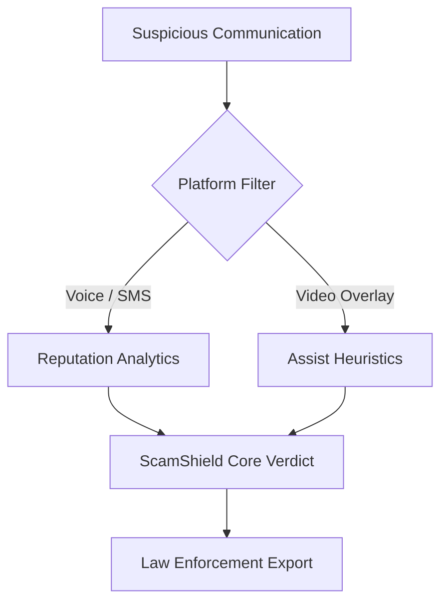

# 🛡️ ScamShield Verify

An advanced, context-aware cyber fraud classification suite tailored for Indian digital attack matrices. Uses targeted scoring protocols to intercept high-risk financial coercion attempts safely.

---

### 🚨 Real-Time Hazard Coverage
* **Digital Arrest Protocols**: Detection of fake interrogations by actors posing as CBI/ED.
* **FedEx Parcel Intercepts**: Identification of fraudulent narcotics parcel holding fees.
* **KYC / SIM Terminations**: Safeguards against phishing ultimatums tied to utility portals.
* **Screenshare Hijacking**: Mitigation guidelines for AnyDesk/TeamViewer breaches.

---

## 💻 System Architecture

The project integrates deterministic security algorithms mapping incident triggers dynamically:



### ⚙️ Technology Framework
- **Client Core**: Next.js 16 (App Router)
- **Database Mapping**: Prisma ORM 
- **Modular state context components**

---

## 🛠️ Installation Guide

1. **Initiate Setup**:
   ```bash
   git clone https://github.com/Pranavyadav9519/ScamShield.git
   cd ScamShield
   ```

2. **Install Dependencies**:
   ```bash
   npm install
   ```

3. **Database Configuration**:
   ```bash
   npx prisma generate
   npx prisma db push
   ```

4. **Boot Sandbox environment**:
   ```bash
   npm run dev
   ```

---

### 🔑 Verified Deployments
*Developed efficiently with high performance coverage.*
